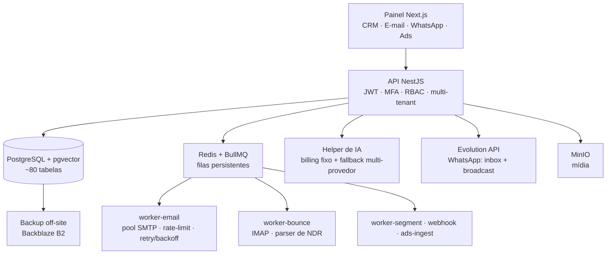

# Fluxa

Suíte SaaS multi-canal de marketing e CRM (e-mail + WhatsApp + automação), auto-hospedada. Motor de entregabilidade de e-mail, broadcast de WhatsApp e orquestração multi-LLM próprios. Em produção: 500 mil+ envios processados.

**Stack:** TypeScript · NestJS · Next.js · PostgreSQL + pgvector · Redis + BullMQ · Prisma · Docker · Nginx · Evolution API (WhatsApp) · MinIO · monorepo pnpm + Turborepo · VPS Linux

---

## O problema

Marketing multicanal normalmente exige uma pilha de SaaS — uma ferramenta para e-mail, outra para WhatsApp, outra para CRM, outra para rastreio — cada uma cobrando por contato, com o dado preso em cada fornecedor.

O Fluxa reúne isso numa suíte própria, auto-hospedada: disparo de e-mail e WhatsApp segmentado, CRM com scoring, automações e back-office administrativo. Inclui as peças que normalmente se terceiriza: rastreio de abertura/clique, tratamento de bounce e gestão de entregabilidade SMTP.

---

## Arquitetura

O envio passa por um pipeline próprio: fila no Redis/BullMQ → worker com pool SMTP, rate-limit e retry → injeção de pixel de abertura e reescrita de links no envio → captura de bounce por IMAP.

---

## Decisões de arquitetura

### Motor de entregabilidade próprio
- **Rastreio:** pixel de abertura + reescrita de `href` para redirect assinado (clique), aplicados no momento do envio.
- **Bounce:** worker dedicado lê a caixa de retorno por IMAP, faz parse do NDR e classifica **hard** (suprime) vs **soft** (retenta).
- **SMTP:** pool de conexões, rate-limit configurável e retry com backoff que trata o `421` (throttle do provedor) como temporário, não como falha definitiva.
- **Conformidade:** lista de supressão, footer de descadastro (LGPD/CAN-SPAM), SPF/DKIM/DMARC.

### WhatsApp broadcast — estado no banco
O disparo em massa guarda o estado no banco (jobs + destinatários): pausa/retoma/cancela em tempo real, sobrevive a restart do container, cadência com jitter. Roda sobre uma instância Evolution API auto-hospedada.

### IA desacoplada do billing
- Prompts no banco, não no código — agentes ajustáveis por painel, sem deploy.
- Roteamento prioriza um tier de custo fixo, com fallback multi-provedor (ex.: helper → Gemini).
- Embeddings em Gemini (768-d) sobre pgvector.
- Uso de IA logado, com painel de monitoramento.

### pgvector dentro do Postgres
Os vetores ficam ao lado do dado relacional — a recuperação faz JOIN de vetor + metadado numa query, sem sincronizar dois sistemas. Índice HNSW para a busca aproximada.

### Monorepo auto-hospedado
11 apps (APIs, painéis, 5 workers) compartilhando 7 pacotes internos (schema Prisma, UI, renderer de e-mail, compilador de segmento). Infra em Docker num VPS: Postgres, Redis, MinIO, Evolution.

---

## Números (verificados em produção)

| Métrica | Valor |
|---|---|
| Envios processados | 500 mil+ — com tracking de abertura/clique e bounce |
| Leads | ~27,7 mil |
| Campanhas | 427 |
| Segmentação | 1.225 segmentos · 1.250 tags |
| Código | ~80 tabelas · 11 apps · 7 pacotes · 5 workers de fila |
| Canais | E-mail (SMTP próprio) · WhatsApp (Evolution: inbox + broadcast) |

Multi-tenancy em validação (organizations + RBAC + isolamento por tenant); o produto **zap** (inbox WhatsApp multi-cliente) é o caminho SaaS em andamento.

Benchmark planejado: taxa de entrega/abertura por coorte e throughput do motor SMTP sob throttle — serão medidos e publicados aqui.

---

## Segurança & operação

- JWT + MFA (TOTP) + RBAC hierárquico com cargos customizáveis
- Audit log das ações sensíveis
- Entregabilidade: SPF/DKIM/DMARC, supressão, classificação de bounce
- Multi-tenant: organizations + isolamento por tenant (em validação)
- Docker atrás de Nginx, em VPS Linux
- Backups automatizados com cópia off-site (Backblaze B2)

---

## Sobre este repositório

Repositório-vitrine: documenta a arquitetura e as decisões técnicas do Fluxa, um produto proprietário em produção. O código-fonte não é publicado. O objetivo é mostrar como o sistema foi pensado.

**Lucas Epifanio Lopes** — Desenvolvedor Full-Stack
**Contato:** [lucas@grafoedtech.com](mailto:lucas@grafoedtech.com) · [LinkedIn](https://www.linkedin.com/in/lucas-epifanio-lopes-a005503b6) · [grafoedtech.com](https://grafoedtech.com)
